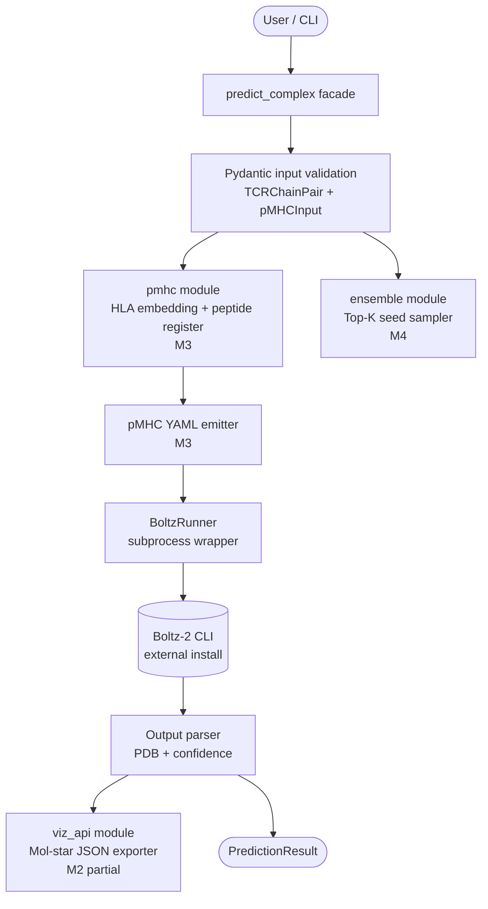

# ParaFold

> TCR-pMHC repertoire structural predictor — Boltz-2 base + HLA-allele-conditioned post-processing head + repertoire ensemble sampling.

[](https://github.com/hinanohart/parafold/actions/workflows/ci.yml)
[](LICENSE)
[](https://www.python.org/)

**ParaFold** is an open-source Python package for predicting the structural ensemble of T-cell receptor / peptide / MHC (TCR-pMHC) complexes. It wraps [Boltz-2](https://github.com/jwohlwend/boltz) as the underlying structure predictor (via subprocess — not a fork), then layers a typed Python API and CLI on top.

The package today (M0-M2) ships the complete typed scaffold: input validation, a frozen-dataclass `BoltzRunner` subprocess wrapper, a pydantic input boundary, and the `parafold` CLI. Full prediction output (pMHC YAML emission, HLA-allele conditioning, and ensemble sampling) lands in M3-M5 on the roadmap below.

## Architecture



> **Pre-M3 status.** M0-M2 ship the typed scaffold only. Until M3 lands the pMHC YAML emitter, the CLI prints a roadmap notice and exits non-zero, and the Python API raises `NotImplementedError`. The snippets below show the M3 interface shape, not current behaviour.

## Why ParaFold?

Boltz-2 is a general structure predictor. ParaFold adds:

- **HLA-allele conditioning** — a post-processing head that will incorporate class-I/II allele context when generating the final complex. **(M3)**
- **Repertoire ensemble sampling** — top-K seed sampling with rescoring across TCR clonotypes, evaluated for CDR3 contact-recovery on benchmarks drawn from IEDB / VDJdb / TCR3d. **(M4)**
- **Mol\* + UMAP visualisation** — for individual complexes and projected repertoire space. **(M5)**

## Install

```bash
# Today (editable install from a clone, M0-M2 scaffold):
git clone https://github.com/hinanohart/parafold.git
cd parafold
pip install -e ".[dev]"

# Planned at M3 (not yet on PyPI):
pip install parafold
pip install parafold[torch]   # GPU support
pip install parafold[umap]    # repertoire space projections
```

Boltz-2 itself must be installed separately:

```bash
pip install boltz   # external; requires Linux/CUDA for full prediction
```

## Quickstart (M3-shaped interface)

```bash
parafold predict \
  --tcr-alpha tcr_a.fa \
  --tcr-beta tcr_b.fa \
  --peptide GILGFVFTL \
  --hla "HLA-A*02:01" \
  --out out.pdb
```

```python
from parafold import predict_complex

# Pre-M3: this call raises NotImplementedError.
# M3+: returns a PredictionResult with pdb_path + confidence.
result = predict_complex(
    tcr_alpha="CAVSANSGTYKYIF",
    tcr_beta="CASSIRSSYEQYF",
    peptide="GILGFVFTL",
    hla="HLA-A*02:01",
)
print(result.pdb_path, result.confidence)
```

## Module layout

```
src/parafold/
├── core/
│   ├── boltz_runner.py   Boltz-2 subprocess wrapper (frozen dataclass)   M0-M2
│   └── types.py          Shared pydantic types (TCRChainPair, pMHCInput)  M0-M2
├── pmhc/
│   ├── embedding.py      HLA allele embedding                             M3
│   ├── register.py       Peptide register logic                           M3
│   └── head.py           Post-processing conditioning head                M3
├── ensemble/
│   └── sampler.py        Repertoire top-K seed sampler                    M4
├── viz_api/
│   └── molstar.py        Mol* JSON exporter                               M2
├── facade.py             predict_complex entry point
└── cli.py                parafold CLI (typer)
```

## Roadmap

| Milestone | Scope | Status |
|---|---|---|
| M0 | repo init, license, pyproject | ✅ |
| M1 | module skeleton, typing, tests | ✅ |
| M2 | Boltz-2 subprocess wrapper | ✅ |
| M3 | pMHC module + 1st PyPI release | planned |
| M4 | repertoire ensemble (HF Hub weights) | planned |
| M5 | Mol\* + repertoire UMAP viz | planned |
| M6 | docs + CI | partial (CI only) |
| M7 | tag / arXiv preprint | planned |

## Datasets

ParaFold does **not** redistribute IEDB / VDJdb / TCR3d data. Fine-tuning recipes will fetch from upstream under each provider's own license at M3 release time.

## License

MIT — see [LICENSE](LICENSE).

Upstream component licenses:

| Component | License | Use |
|---|---|---|
| Boltz-2 | MIT | base structure predictor (subprocess) |
| Mol\* | MIT | viz (M5) |
| UMAP-learn | BSD-3 | projection (optional, `[umap]` extra) |
| PyTorch | BSD-3 | core (optional, `[torch]` extra) |
| Hydra | MIT | config (optional, `[sci]` extra) |
| Biotite | BSD-3 | structure I/O (optional, `[sci]` extra) |

PHATE (GPL-3) is intentionally **not** used.

> Note: Boltz-2 itself currently requires Linux/CUDA. ParaFold's own typed API is OS-agnostic (CI runs on Linux + macOS + Windows), but full structural prediction requires a local Boltz-2 install.

## Citation

Preprint forthcoming. See `CITATION.cff` once M3 ships.

## Contributing

Issues and PRs welcome. Run `pytest`, `mypy`, and `ruff` before opening a PR.
